# Module_20_Challenge: Joint Savings account

This application uses Solidity smart contract that accepts two user addresses. These addresses will be able to control a joint savings account. These features will consist of the ability to deposit and withdraw funds from the account.

---

## Technologies
This was run on a pc using Windows 10

This project leverages python 3.8.11 with the following packages:

* [pandas](https://pandas.pydata.org/pandas-docs/stable/index.html) - BSD-licensed library providing high-performance, easy-to-use data structures and data analysis tools for the Python programming language.

* [Solidity](https://docs.soliditylang.org/en/v0.8.9/) - Solidity is an object-oriented, high-level language for implementing smart contracts. Smart contracts are programs which govern the behaviour of accounts within the Ethereum state.

* [Remix IDE](https://remix-ide.readthedocs.io/en/latest/) - For the entire journey of contract development as well as being a playground for learning and teaching Ethereum.

---

## Installation Guide

First you will need to open the Remix IDE and complete the following steps:

1. Import joint_savings.sol into the Remix IDE

2. Compile the file and make sure you select version 0.5.0 from the Compiler dropdown.

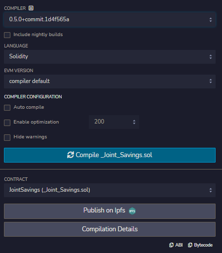

3. Deploy the contract and make sure you select "JavaScript VM" from the Environment dropdown.

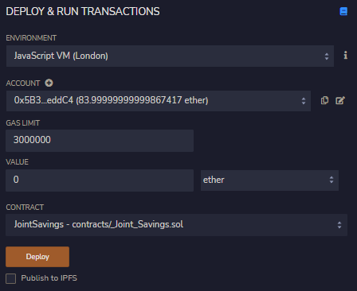

---

## Examples

The images below are examples of what the joint_savings.sol file will display when you run it.

---
Transaction 1: Send 1 ether as wei.

Deploy and Run the first transaction

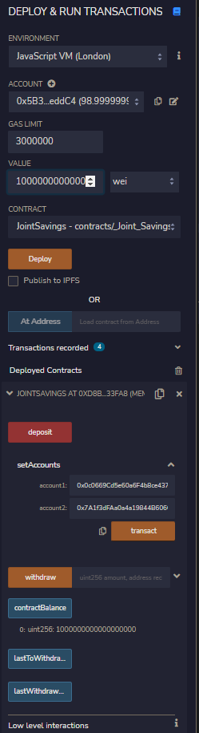

Get the status of the first transaction.

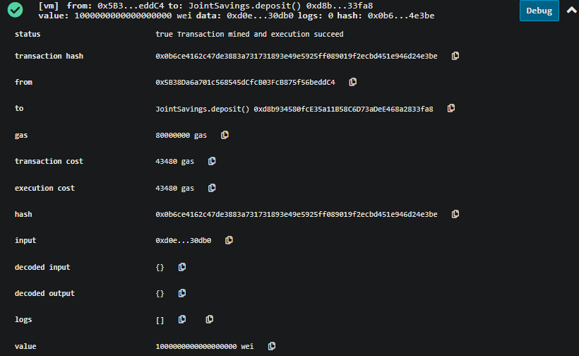

Check the contract balance for the amount deposited in the first transaction.

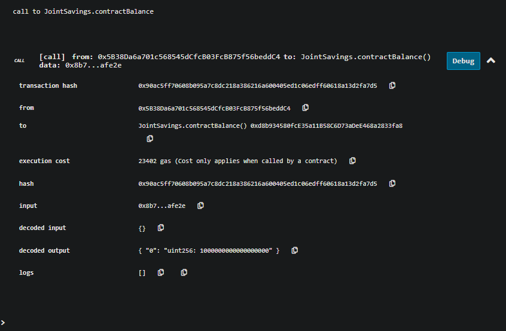

Transaction 2: Send 5 ether.

Deploy and Run the second transaction

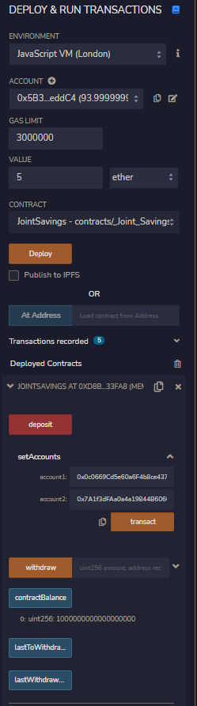

Get the status of the second transaction.

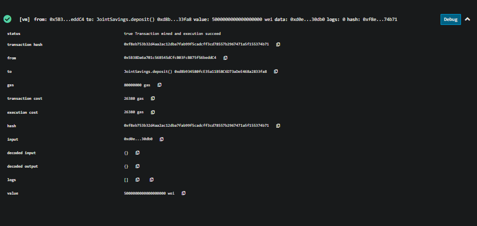

Check the contract balance for the amount deposited in the second transaction.

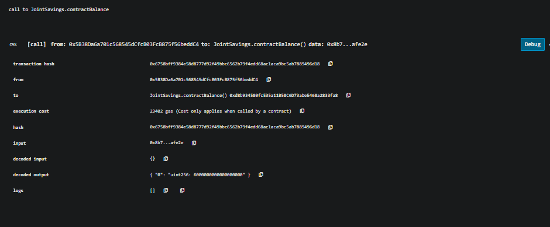

Transaction 3: Send 10 ether as wei.

Deploy and Run the third transaction

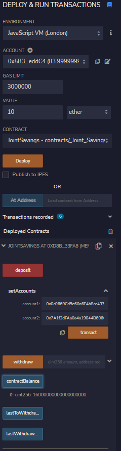

Get the status of the third transaction.

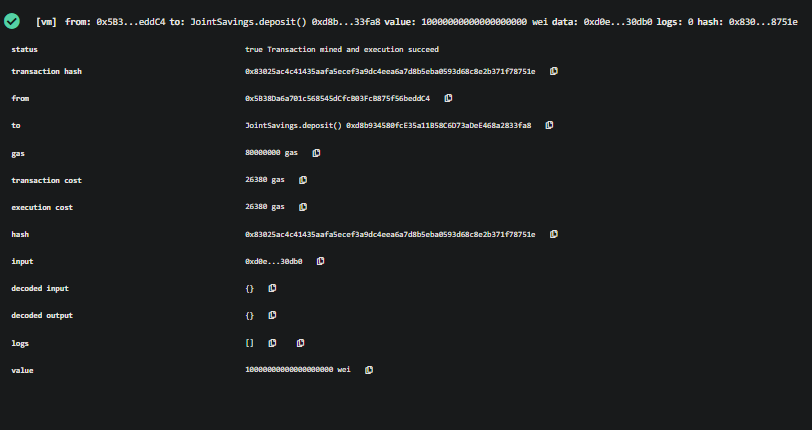

Check the contract balance for the amount deposited in the third transaction.

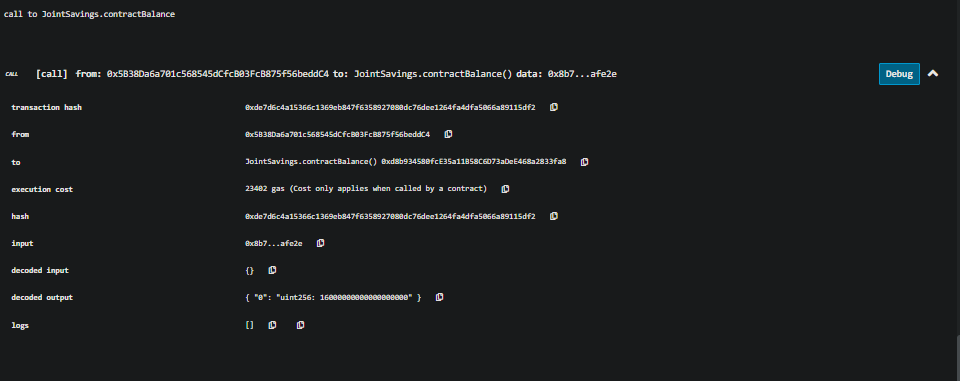

Contract withdrawl fucntion tested

Test one: Withdraw 5 ether into "accountOne"

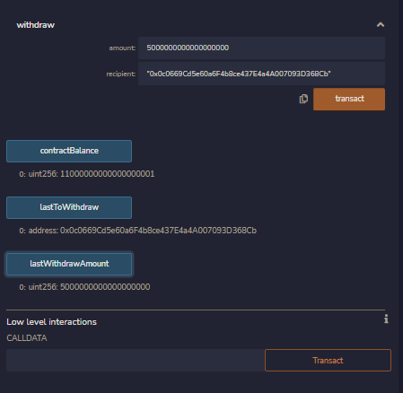

Test two: Withdraw 10 ether into "accountTwo"

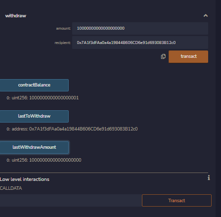
---

## Contributors

Andrew McKay

Email: Andrew.V.McKay@gmail.com

---